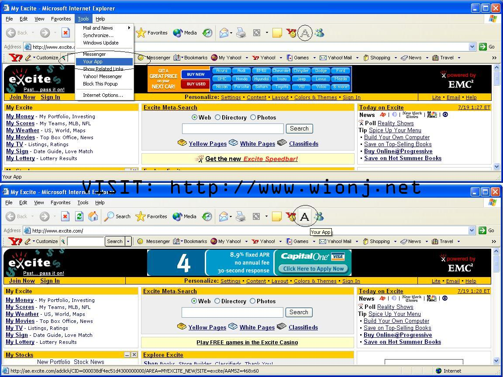



## Add your app to the Internet Explorer Tool's Menu and Toolbar

### Description

I created this code so people can get there self into an Internet Explorer.
 
### More Info
 

             |
---                |---
**Submitted On**   |2002-10-23 20:20:46
**By**             |[John Wion](https://github.com/Planet-Source-Code/PSCIndex/blob/master/ByAuthor/john-wion.md)
**Level**          |Advanced
**User Rating**    |4.8 (19 globes from 4 users)
**Compatibility**  |VB 6\.0
**Category**       |[Internet/ HTML](https://github.com/Planet-Source-Code/PSCIndex/blob/master/ByCategory/internet-html__1-34.md)
**World**          |[Visual Basic](https://github.com/Planet-Source-Code/PSCIndex/blob/master/ByWorld/visual-basic.md)
**Archive File**   |[Add\_your\_a14862810232002\.zip](https://github.com/Planet-Source-Code/john-wion-add-your-app-to-the-internet-explorer-tool-s-menu-and-toolbar__1-37061/archive/master.zip)

